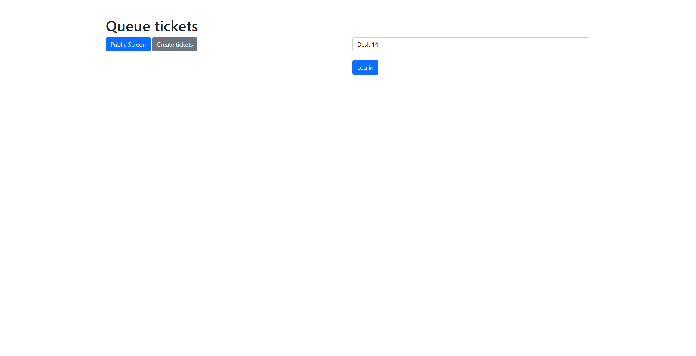
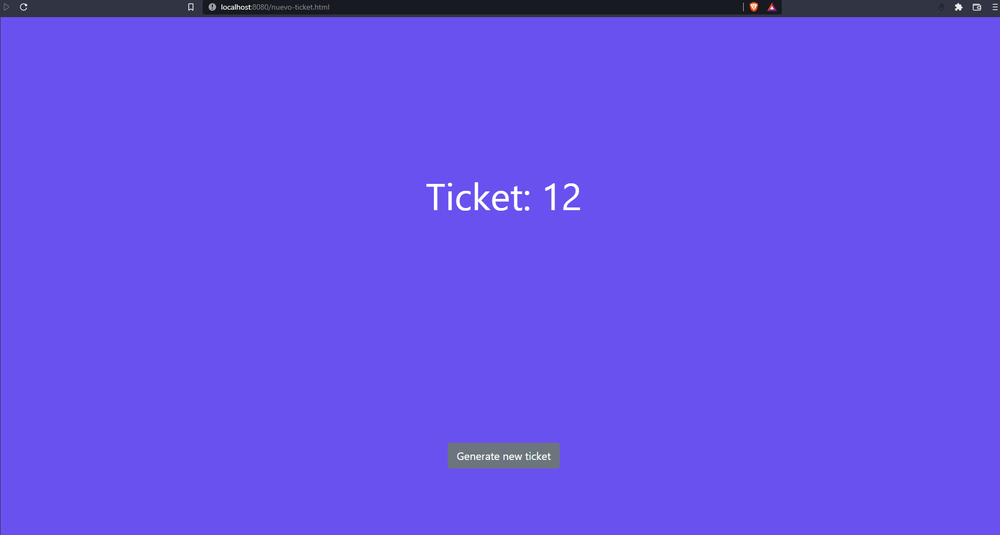
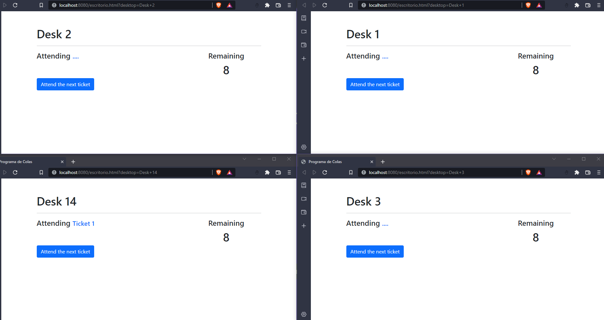
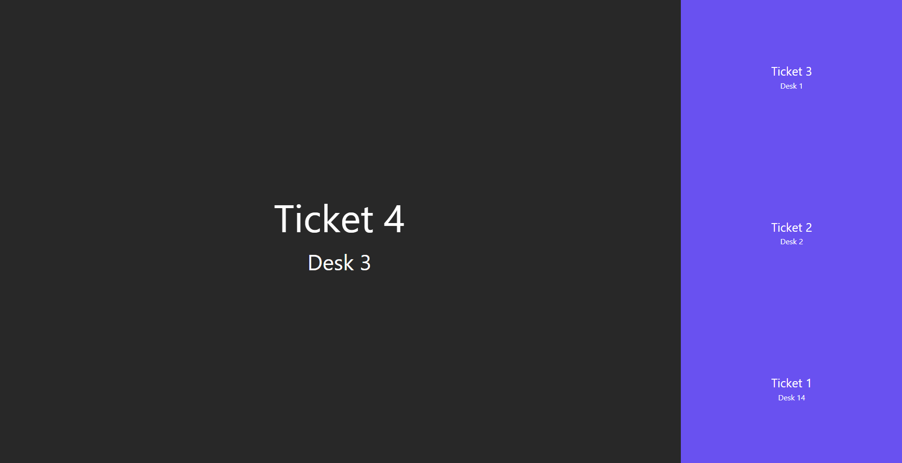

# A Queue app using sockets
A wep app to manage the customers queue in a store or other place that needs it.

Used technology: Node.js, Express, Socket.io, Git. Frontend: Javascript , HTML, Bootstrap

## Screenshots:

### Index

### Generate tickes

### Attending tickets

### Public Screen

